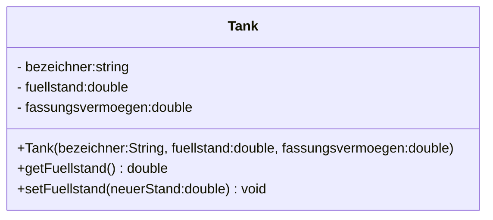

```mermaid
classDiagram
    class Tank {
        - bezeichner:string
        - fuellstand:double
        - fassungsvermoegen:double
        +Tank(bezeichner:String, fuellstand:double, fassungsvermoegen:double)
        +getFuellstand() double
        +setFuellstand(neuerStand:double) void
    }
```
