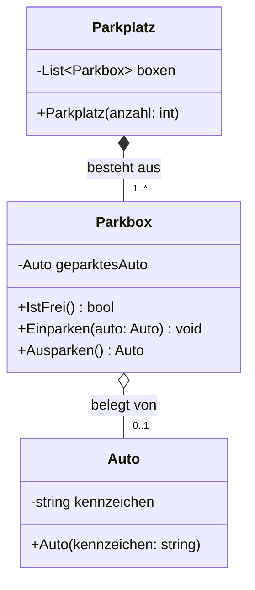

```mermaid
classDiagram
    class Parkplatz {
        -List~Parkbox~ boxen
        +Parkplatz(anzahl: int)
    }
    class Parkbox {
        -Auto geparktesAuto
        +IstFrei() bool
        +Einparken(auto: Auto) void
        +Ausparken() Auto
    }
    class Auto {
        -string kennzeichen
        +Auto(kennzeichen: string)
    }

    Parkplatz *-- "1..*" Parkbox : besteht aus
    Parkbox o-- "0..1" Auto : belegt von
```
