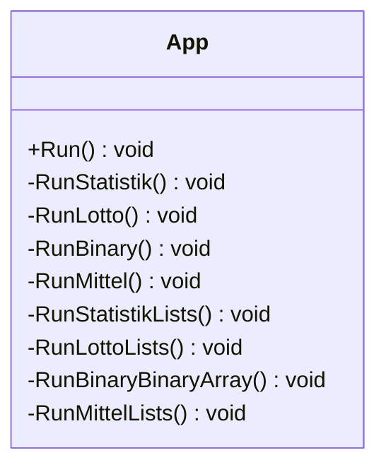

# Klassendiagramm - Aufgabe 01

```mermaid
classDiagram
    class App {
        +Run() void
        -RunStatistik() void
        -RunLotto() void
        -RunBinary() void
        -RunMittel() void
        -RunStatistikLists() void
        -RunLottoLists() void
        -RunBinaryBinaryArray() void
        -RunMittelLists() void
    }
```
