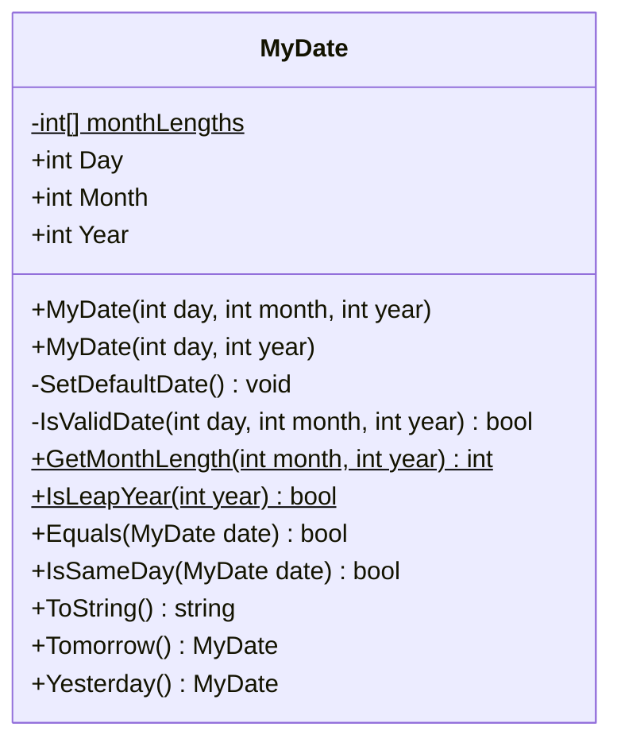

# Klassendiagramm - Aufgabe 06 (MyDate)

```mermaid
classDiagram
    class MyDate {
        -int[] monthLengths$
        +int Day
        +int Month
        +int Year

        +MyDate(int day, int month, int year)
        +MyDate(int day, int year)
        
        -SetDefaultDate() void
        -IsValidDate(int day, int month, int year) bool
        
        +GetMonthLength(int month, int year)$ int
        +IsLeapYear(int year)$ bool
        
        +Equals(MyDate date) bool
        +IsSameDay(MyDate date) bool
        +ToString() string
        +Tomorrow() MyDate
        +Yesterday() MyDate
    }
```
