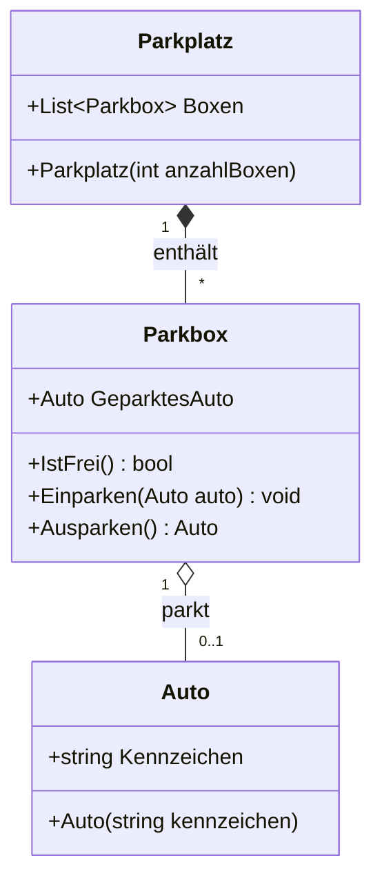

# Klassendiagramm - Aufgabe 08 (Parkplatz)

```mermaid
classDiagram
    class Auto {
        +string Kennzeichen
        +Auto(string kennzeichen)
    }

    class Parkbox {
        +Auto GeparktesAuto
        +IstFrei() bool
        +Einparken(Auto auto) void
        +Ausparken() Auto
    }

    class Parkplatz {
        +List~Parkbox~ Boxen
        +Parkplatz(int anzahlBoxen)
    }

    Parkplatz "1" *-- "*" Parkbox : enthält
    Parkbox "1" o-- "0..1" Auto : parkt
```
