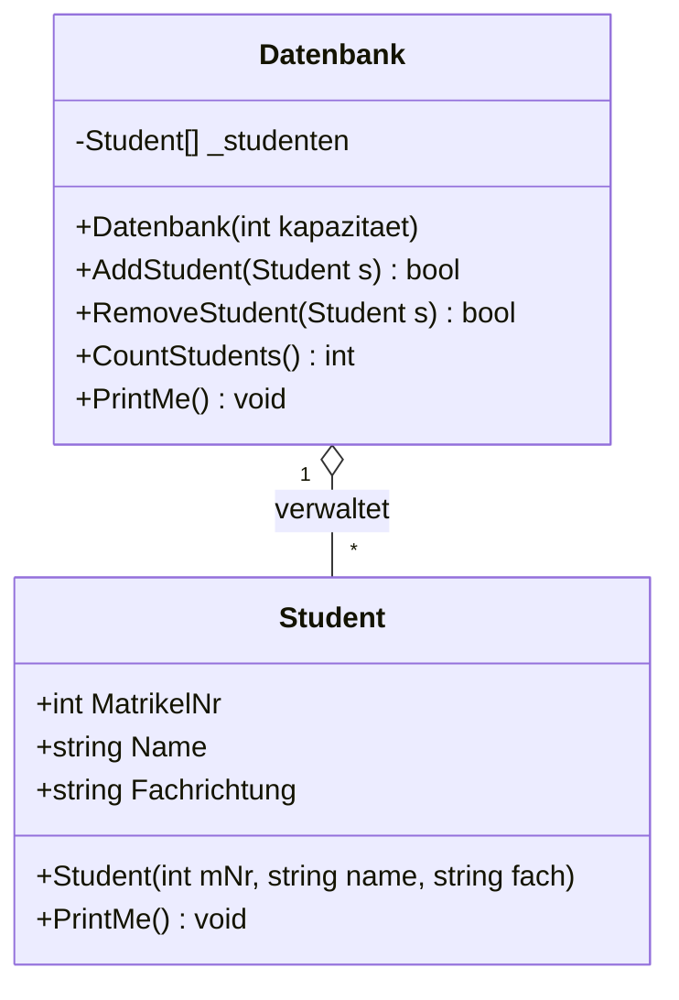

# Klassendiagramm - Aufgabe 09 (StudentenDatenbank)

```mermaid
classDiagram
    class Student {
        +int MatrikelNr
        +string Name
        +string Fachrichtung
        +Student(int mNr, string name, string fach)
        +PrintMe() void
    }

    class Datenbank {
        -Student[] _studenten
        +Datenbank(int kapazitaet)
        +AddStudent(Student s) bool
        +RemoveStudent(Student s) bool
        +CountStudents() int
        +PrintMe() void
    }

    Datenbank "1" o-- "*" Student : verwaltet
```
