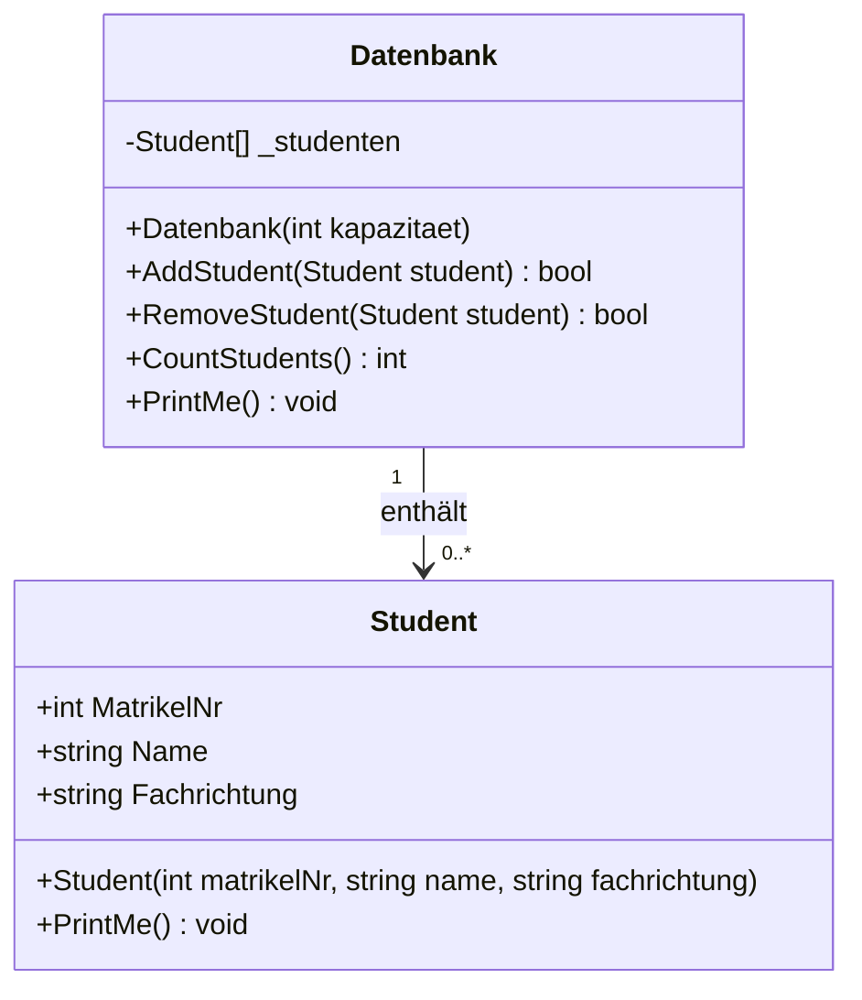

```mermaid
classDiagram
    class Student {
        +int MatrikelNr
        +string Name
        +string Fachrichtung
        +Student(int matrikelNr, string name, string fachrichtung)
        +PrintMe() void
    }

    class Datenbank {
        -Student[] _studenten
        +Datenbank(int kapazitaet)
        +AddStudent(Student student) bool
        +RemoveStudent(Student student) bool
        +CountStudents() int
        +PrintMe() void
    }

    %% Beziehung: Die Datenbank "besitzt" oder "enthält" Studenten
    Datenbank "1" --> "0..*" Student : enthält
```
